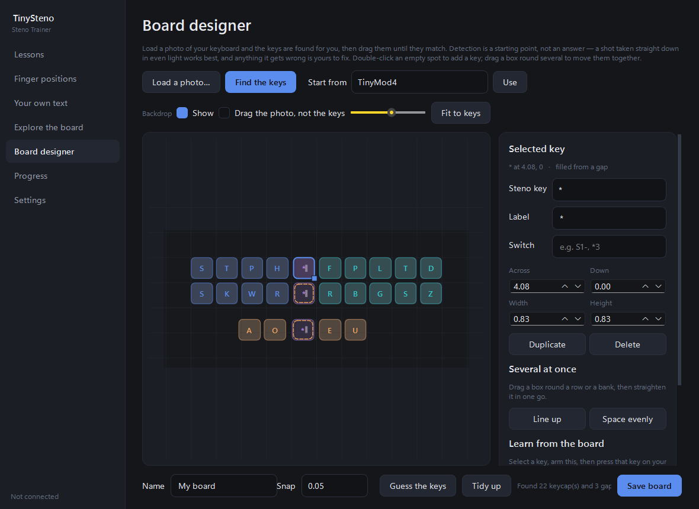

# TinySteno

A Windows practice trainer for open-source steno keyboards. It shows you a word, lights the
exact chord on an on-screen board, reads the stroke straight off your hardware, and tells
you exactly what happened.


## Running it

Grab `TinySteno.exe` and double-click it. Nothing to install — no Python, no Qt, no
dependencies. It is a single 48 MB file that starts in about a second and can live
anywhere, including a USB stick.

To run from source instead:

```bash
py run.py
```

Dependencies: `PySide6`, `pyserial`.

```bash
py -m pip install PySide6 pyserial
```

## Before you practise

1. Your board must be sending **Gemini PR** over a serial port. That is the default for
   QMK steno boards and what Plover recommends, so most open-source keyboards already do.
   On a TinyMod4 it means the jumper marked `Serial = GeminiPiper`; that jumper is read
   once at power-up, so changing it needs a full USB replug.
2. **Close Plover.** The serial port is exclusive. TinySteno retries every couple of
   seconds and picks the port up on its own once Plover releases it.

If nothing arrives, open **Explore the board** and press a key.

## Boards

TinySteno is not tied to one keyboard. A board profile describes which keys exist and where
they sit, in key-pitch units, so the gap between banks, the drop to the thumbs and tall keys
that span two rows are all just coordinates.

| Built-in | Keys | Notes |
|---|---|---|
| **TinyMod4** | 24 | Verified against real hardware. Two S switches, two asterisks. |
| **Standard stenotype** | 23 | The reference layout: tall S and asterisk, plus a number bar. |
| **Generic split** | 26 | A common DIY shape — a starting point to adjust, not a specific product. |

Only these three ship built in, and that is deliberate. Reconstructing other boards'
layouts from memory would risk teaching people the wrong positions — the same reason lesson
outlines are curated rather than guessed. Your board goes in the **board designer**
instead.

Profiles are validated on load: unknown steno keys, unsupported protocols and overlapping
keycaps are all rejected with a message rather than silently drawing something wrong.

When a board lacks a key, lessons needing it are dropped rather than asking you to press
something you do not have.

## The board designer

Photograph your keyboard, and the app traces it.



**It finds the keycaps for you.** The photo is thresholded against a local mean rather than
a global one, because the shot people actually take has one end of the board lit and the
other in shadow, and black keycaps on a black PCB differ from their surroundings by a few
levels. Merged caps are split back apart, rows are straightened, and the key pitch is
measured from the caps themselves.

**It fills in switches with no keycap.** A bare switch does not read as a keycap, but it
does leave an exactly key-sized hole in an otherwise even row — which is how the asterisk
column looks on most hobbyist boards. Holes a whole number of pitches wide get a key, drawn
dashed so you can see which ones were never actually in the photo.

**It guesses which steno key each one is.** Not by measuring, but by counting: English
Stenotype fixes the banks at four columns on the left and five on the right, so anything
past nine keys in a row is the asterisk column and can be nothing else. That rule is what
gets a 24-key TinyMod, a 23-key stenotype with tall S and asterisk, and a 26-key split
board all right from geometry alone — each is asserted in `tests.py`.

**Then you correct it**, because none of the above is reliable on an awkward photo and it
does not pretend to be. The photo stays behind the keys as a tracing backdrop, in the same
coordinate space, so dragging a key onto the picture of a switch *is* writing its
coordinates. Drag a box round a bank to move it as one, `Line up` to straighten a row,
`Space evenly` to fix the gaps, arrow keys to nudge, double-click to add a key.

**And for what a photo cannot tell you: press the key.** Arm *Press keys on my board* and
walk the board one switch at a time. Each press writes what the hardware actually reported
— including the physical switch name, which is the only thing that distinguishes the two S
switches or the four asterisk bits — and moves the selection on. That is the difference
between a layout that looks right and one that is known to be right.

Saving writes JSON to `%LOCALAPPDATA%\TinyStenoTrainer\boards\` and switches you to it. It
is reloaded through the same parse and validation as a hand-written file, so anything that
would fail on next start fails now instead.

You can still edit that JSON by hand — **Settings → Board → Save a copy I can edit** writes
the current profile there as a template. A file reusing a built-in `id` replaces it, so a
layout that is wrong for your hardware can be corrected without waiting for a new build.

## Dictionaries

By default TinySteno reads Plover's own `user.json`, `commands.json` and `main.json` in
Plover's priority order. **Settings → Dictionaries** lets you point at any Plover-format
JSON dictionaries instead, in whatever order you want. They are only ever read, never
written.

## What it does

**Reads the hardware directly** — decodes Gemini PR frames itself and resolves strokes
against your dictionaries. It asserts DTR on open, without which the firmware sends nothing
and a working board looks dead.

**Coaches the left/right mix-up.** Pressing `T-` where `-T` was needed is the dominant
beginner error coming from QWERTY. TinySteno names it, draws an arc from the key you hit to
the key you wanted, and tracks it separately in your stats.


The rule is deliberately strict: a swap is only reported when it actually explains the
mistake. Two chords sharing a letter across the banks by coincidence — `TKOG` against `KAT`
— is reported as a plain wrong chord, not a hand mix-up.

**Teaches where your fingers go.** Each finger owns one vertical column. The part beginners
miss is that your fingers rest in the *seam between the two rows*, not centred on a key,
because many sounds need both keys of a column held at once. Fourteen chords in the built-in
lessons require it: `TKOG` (dog) is impossible unless your left ring finger can hold T and K
together.


Resting positions are derived from each finger's key centroids rather than hand-placed, so
an unusual board gets sensible marks automatically.

**Teaches verified outlines.** `main.json` contains a lot of misstroke-forgiveness entries,
so ranking by length alone would happily teach `OB` for "on" instead of `OPB`. Lesson
outlines are curated and re-checked against your dictionary at startup; anything that does
not write what it claims is dropped rather than silently taught.

**Accepts alternate outlines.** Any outline that writes the target word counts as correct.
The drill still names the one it was teaching so you see both.

**Fades the hints.** First time through you get the word, the outline text, and the lit
chord. After one clean run the outline text drops. After three, no hint at all. Any error
brings the full hint straight back.

## The lessons

| Lesson | What it covers |
|---|---|
| First words | Ten short words — `-T`, `KAT`, `OPB`, `TKOG`, `SKP` … |
| **Left hand, right hand** | Minimal pairs: the/it, top/pot, tap/pat, tip/pit, step/pets |
| The four thumbs | A and O on the left, E and U on the right, and their combinations |
| Everyday briefs | Sixteen very common words that collapse to one or two keys |
| Longer words | Fuller chords using both hands — `TPOBGS`, `KWEUBG`, `PWROUPB` |
| Punctuation and commands | `-PL`, `S-P`, `KPA`, `H-PB`, `TK-LS` |
| Sentences | Multi-stroke copy practice, one stroke per word |

Plus **your own text** — paste anything and it becomes a drill, with words missing from
your dictionary listed rather than silently skipped.

## Other screens

- **Finger positions** — the placement guide, the resting-seam technique, and the
  double-press chords that depend on it.
- **Explore the board** — click keys to build a chord and see what it writes, with the
  finger reading underneath. Doubles as the connection test.
- **Board designer** — trace your own keyboard from a photo, or label it by pressing its
  keys. See above.
- **Progress** — accuracy, solid items, and a breakdown of where the mistakes actually are,
  with hand mix-ups called out separately. Feeds the review deck.
- **Settings** — board, connection, dictionaries, hint mode, session length, and a QWERTY
  fallback for practising without the device attached.

## Where things live

| | |
|---|---|
| Your progress | `%LOCALAPPDATA%\TinyStenoTrainer\profile.json` |
| Your board profiles | `%LOCALAPPDATA%\TinyStenoTrainer\boards\*.json` |
| Dictionaries read | Plover's, or whatever you point it at |

## Layout

```
run.py                  entry point
tests.py                headless checks — protocol, boards, detection, analysis, session
smoke_gui.py            builds the window, drives a simulated session, renders PNGs
tools/synthboard.py     renders a fake board photo with known geometry, for the tests
tinysteno/
  protocol.py           Gemini PR decoding, RTFCRE formatting and parsing
  board.py              board profiles, built-ins, validation and the user registry
  boardimage.py         finding the keycaps in a photo and guessing what they are
  machine.py            serial thread, DTR handling, reconnection
  dictionary.py         Plover dictionary loading and reverse lookup
  analysis.py           comparing what you pressed against what was asked
  fingering.py          which finger owns which column, and double-press detection
  lessons.py            curated lesson content plus startup validation
  session.py            the drill loop, hint fading, spaced repetition
  storage.py            settings, per-item stats, session history
  layout.py             QWERTY equivalents for the keyboard fallback
  theme.py              palette and stylesheet
  widgets/keyboard.py   the painted board, rendered from a profile
  widgets/layoutcanvas.py  the editable board: drag, resize, trace over a photo
  screens/              one module per screen
```

## Tests

```bash
py tests.py
```

Covers the hardware frame captures, hyphen and number-bar conventions, frame
resynchronisation, board profile validation and round-tripping, dictionary lookups, every
error verdict, lesson validation, the drill loop including multi-stroke and undo, hint
fading, finger assignment and double-press detection, and profile round-tripping.

Two guards are worth calling out. One asserts the TinyMod4 profile's geometry is identical
to the hardcoded layout that predated profiles, so generalising the renderer cannot quietly
move a key. Another asserts the derived finger-rest positions match the old hand-placed
ones exactly.

Photo detection is tested against a board it rendered itself, so the right answer is known:
a fake photo goes in, and the checks are that every keycap comes back, that the three
switches drawn without keycaps are recovered from the gaps they leave, that the key pitch
is right to within 2%, and that the result validates as a profile. The key-guessing rule is
tested separately by feeding it each built-in profile's geometry and requiring it to name
every key — 73 keys across three quite different layouts.

```bash
py smoke_gui.py shots
```

Builds the real window, injects strokes exactly as the serial thread would, switches boards,
walks a full session, and writes a PNG of every screen. It also drives the board designer
end to end — renders a board photo, detects it, labels a key from a simulated keypress,
saves the profile and reads it back out of the boards folder — so the whole path is
exercised rather than screenshotted.

### Building the exe

```bash
py -m PyInstaller tinysteno.spec --noconfirm
```

Output lands in `dist/`. Set `TINYSTENO_ONEDIR=1` first for a one-folder build instead —
120 MB, but starts in 0.4 s rather than 1.1 s.

The spec excludes about fifty PySide6 modules the app never imports. That is what keeps it
to 48 MB; a default PySide6 build of this app is over 150 MB. A check in `tests.py` confirms
the source really does import nothing but QtCore, QtGui and QtWidgets, so the exclude list
cannot quietly go stale.

The icon is generated rather than checked in as a binary blob:

```bash
py tools/make_icon.py
```

## Licence

MIT — see [LICENSE](LICENSE). Use it, fork it, ship it; just keep the copyright notice.

Board profiles are plain JSON, so a profile for your own keyboard is yours to share however
you like.

## Known limitation

Only Gemini PR is implemented. It is the default for QMK steno boards and what Plover
recommends, so it covers most open-source keyboards, but a board speaking TX Bolt or Plover
HID will not connect. `protocol` is a field on every board profile and `SUPPORTED_PROTOCOLS`
gates it, so adding one is a contained change rather than a rewrite.

The live serial read has been exercised against a TinyMod4 for port opening and DTR only.
The protocol layer is verified against recorded hardware captures and round-trips all
147,424 dictionary outlines.
