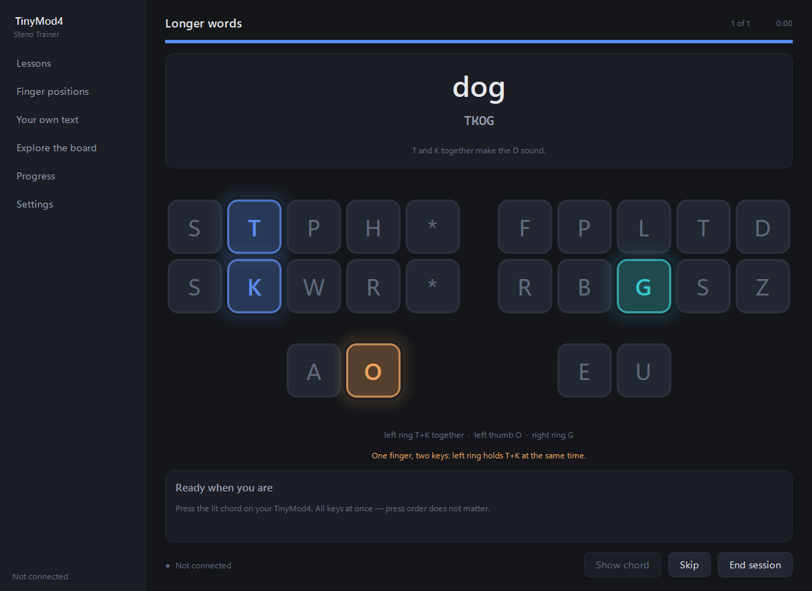
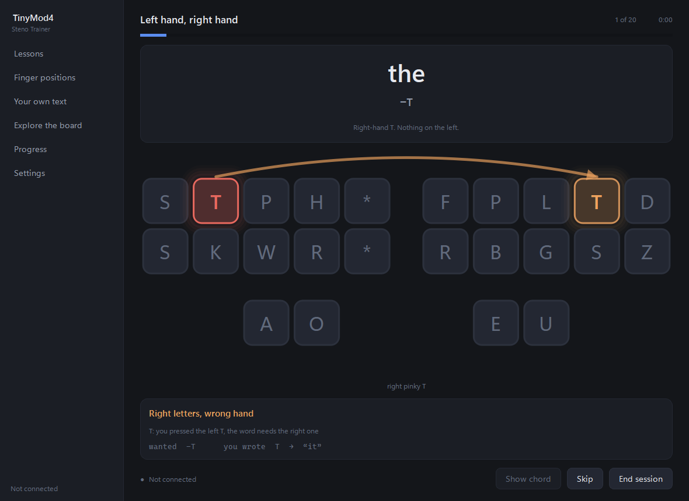
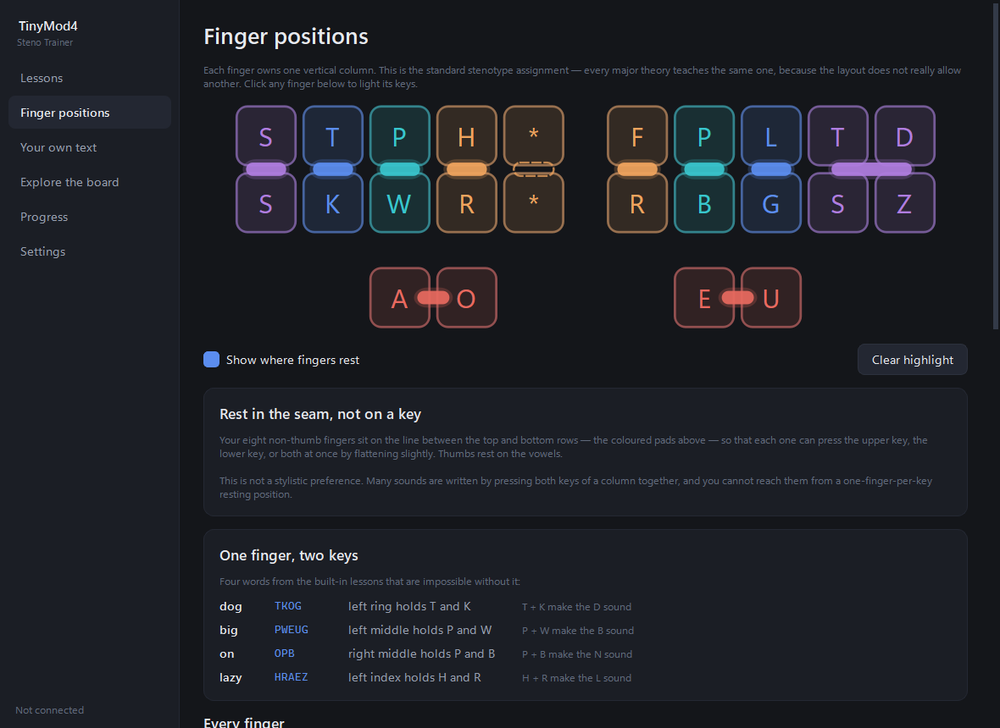

# TinyMod4 Steno Trainer

A Windows 11 practice companion for the TinyMod4. It shows you a word, lights the exact
chord on an on-screen board, waits for you to press it on the real hardware, and then tells
you precisely what happened — including when you reached for the wrong side of the board.



## Running it

```bash
py run.py
```

Or double-click `TinyMod4 Trainer.bat`.

Dependencies (already installed): `PySide6`, `pyserial`.

```bash
py -m pip install PySide6 pyserial
```

## Before you practise

1. **The board must be in Serial mode** — the jumper marked `Serial = GeminiPiper`. The
   jumper is read once at power-up, so changing it needs a full USB replug. The presence of
   COM5 tells you nothing about which mode the firmware is in; both USB interfaces always
   enumerate.
2. **Close Plover.** The serial port is exclusive — Plover and this app cannot both hold
   COM5. The trainer retries every couple of seconds, so it picks the port up on its own
   once Plover releases it.

If nothing arrives, open **Explore the board** and press a key. Strokes appearing there
means the link is good.

## What it does

**Reads the hardware directly.** The app owns COM5, decodes Gemini PR frames itself, and
looks strokes up in your own Plover dictionaries. It asserts DTR on open, without which the
firmware transmits nothing and a working board looks dead.

**Coaches the left/right mix-up.** Pressing `T-` where `-T` was needed is the dominant
beginner error coming from QWERTY. The app names it, draws an arc from the key you hit to
the key you wanted, and tracks it separately in your stats.



The rule is deliberately strict: a swap is only reported when it actually explains the
mistake. Two chords sharing a letter across the banks by coincidence — `TKOG` against `KAT`
— is reported as a plain wrong chord, not as a hand mix-up.

**Teaches where your fingers go.** Each finger owns one vertical column — that part of
stenotype fingering is standard across every major theory. The part beginners miss is that
your fingers rest in the *seam between the two rows*, not centred on a key, because a great
many sounds need both keys of a column held at once. Fourteen chords in the built-in
lessons require it: `TKOG` (dog) is impossible unless your left ring finger can hold T and K
together.



The **Finger positions** screen colours the board by finger — mirrored, so both ring fingers
are the same colour — marks every resting spot, and lets you click a finger to light its
keys. During practice, the chord on screen is read out as "left ring T+K together · left
thumb O · right ring G", and the double-press coaching appears whenever the full hint is
showing.

Where there genuinely isn't a standard, the guide says so: which hand takes the asterisk,
how far the right pinky stretches for `-D` and `-Z`, and the fact that a TinyMod's flat
unsculpted keys make the resting position harder to hold than a real stenotype's contoured
ones.

**Teaches verified outlines.** `main.json` contains a lot of misstroke-forgiveness entries,
so ranking by length alone would happily teach `OB` for "on" instead of `OPB`. Lesson
outlines are curated and every one is re-checked against your dictionary at startup;
anything that does not write what it claims is dropped rather than silently taught.

**Accepts alternate outlines.** Any outline that writes the target word counts as correct.
The drill still names the one it was teaching so you see both.

**Fades the hints.** First time through you get the word, the outline text, and the lit
chord. After one clean run the outline text drops. After three, no hint at all. Any error
brings the full hint straight back.

## The lessons

| Lesson | What it covers |
|---|---|
| First words | Ten short words — `-T`, `KAT`, `OPB`, `TKOG`, `SKP` … |
| **Left hand, right hand** | Minimal pairs: the/it, top/pot, tap/pat, tip/pit, step/pets |
| The four thumbs | A and O on the left, E and U on the right, and their combinations |
| Everyday briefs | Sixteen very common words that collapse to one or two keys |
| Longer words | Fuller chords using both hands — `TPOBGS`, `KWEUBG`, `PWROUPB` |
| Punctuation and commands | `-PL`, `S-P`, `KPA`, `H-PB`, `TK-LS` |
| Sentences | Multi-stroke copy practice, one stroke per word |

Plus **your own text** — paste anything and it becomes a drill, with words missing from
your dictionary listed rather than silently skipped.

## Other screens

- **Finger positions** — the placement guide, the resting-seam technique, and the
  double-press chords that depend on it.
- **Explore the board** — click keys to build a chord and see what it writes, with the
  finger reading underneath. Doubles as the connection test.
- **Progress** — accuracy, solid items, and a breakdown of *where* the mistakes are, with
  hand mix-ups called out separately. Feeds the review deck.
- **Settings** — port selection, hint mode, session length, and a QWERTY fallback so you
  can practise without the device attached.

## No device to hand?

Turn on **Accept QWERTY input** in Settings. Keys map by position, not by letter, so
`s`+`c`+`p` writes "cat". The board shows the QWERTY equivalents when this is on.

## Where things live

| | |
|---|---|
| Your progress | `%LOCALAPPDATA%\TinyStenoTrainer\profile.json` |
| Dictionaries read | `%LOCALAPPDATA%\plover\plover\{user,commands,main}.json` |

Dictionaries are only ever read, never written.

## Layout

```
run.py                  entry point
tests.py                headless checks — protocol, analysis, session, storage
smoke_gui.py            builds the window, drives a simulated session, renders PNGs
tinysteno/
  protocol.py           Gemini PR decoding, RTFCRE formatting and parsing
  machine.py            serial thread, DTR handling, reconnection
  dictionary.py         Plover dictionary loading and reverse lookup
  analysis.py           comparing what you pressed against what was asked
  fingering.py          which finger owns which column, and double-press detection
  lessons.py            curated lesson content plus startup validation
  session.py            the drill loop, hint fading, spaced repetition
  storage.py            settings, per-item stats, session history
  layout.py             the 24 physical switches and their positions
  theme.py              palette and stylesheet
  widgets/keyboard.py   the painted TinyMod4
  screens/              one module per screen
```

## Tests

```bash
py tests.py
```

Covers the hardware frame captures, hyphen and number-bar conventions, frame
resynchronisation, dictionary lookups, every error verdict, lesson validation, the drill
loop including multi-stroke and undo, hint fading, finger assignment and double-press
detection, and profile round-tripping. Every worked example in the finger guide is checked
against the real dictionary, so the guide cannot drift from what the app actually teaches.

```bash
py smoke_gui.py shots
```

Builds the real window, injects strokes exactly as the serial thread would, walks a full
session, and writes a PNG of every screen.

## Known limitation

The live serial path could not be exercised against the physical board — no TinyMod4 was
attached while this was built. The protocol layer is verified against the recorded hardware
captures and round-trips all 147,424 dictionary outlines, and the connection logic was
tested for its retry and error behaviour with no device present, but the first real stroke
from the board is still unproven. If nothing shows up in **Explore the board**, check the
jumper and that Plover has released the port.
